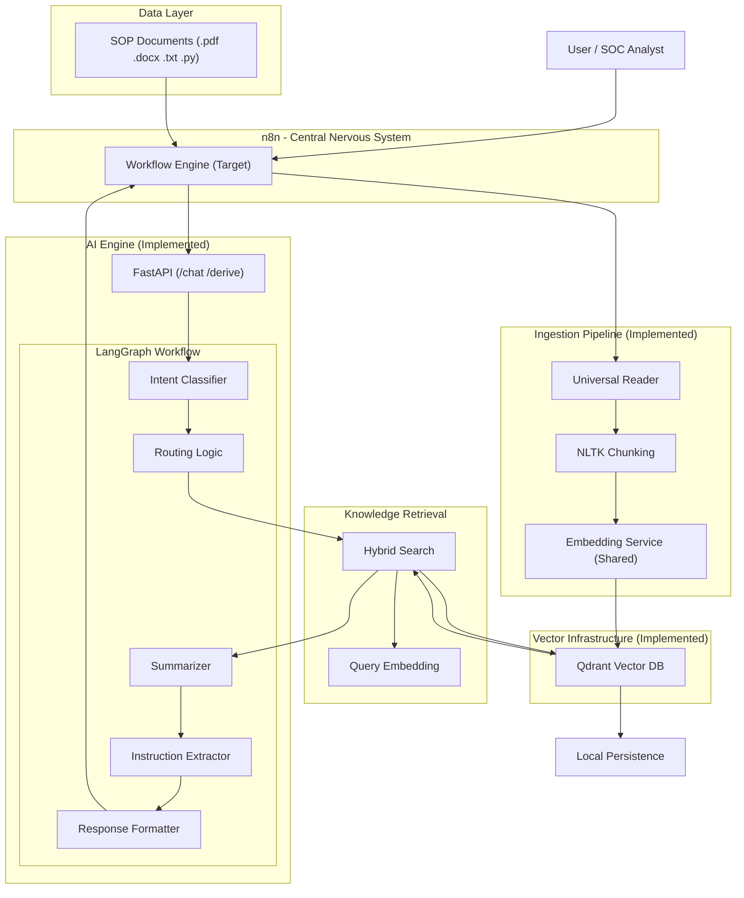

# Enterprise SOP Assistant Backend Architecture

This document defines the current and target architecture. It prioritizes a **Single-Container Vector DB (Qdrant)** for simplicity, speed, and production readiness.

## System Architecture Diagram

## Component Overview: Current vs. Target

### 1. n8n Orchestration (Target Interface)
*   **Workflow Engine**: **[PLANNING]** This will act as the gatekeeper, connecting to Google Drive/WhatsApp/Slack and routing data to our FastAPI.

### 2. Ingestion Utility (`ingest_sops.py`)
*   **Status**: **[IMPLEMENTED]** 
*   **Logic**: Uses NLTK for semantic chunking and `pywin32` for Word doc extraction.
*   **Storage**: Pushes directly to **Qdrant**.

### 3. AI Engine (`sop_assistant_enterprise.py`)
*   **Status**: **[IMPLEMENTED]**
*   **FastAPI**: Active layer that handles requests for `/chat` and `/derive`.
*   **LangGraph**: Active workflow that manages the logic of *Identify Intent -> Retrieve Path -> Summarize -> Format*.

### 4. Vector Infrastructure (Docker)
*   **Qdrant**: **[IMPLEMENTED]** Our unified "Brain." It handles 100% of the vector storage, search, and metadata management in a single lightweight container.
*   **Efficiency**: Replaces the redundant 3-container Milvus setup with a highly optimized Rust-based engine.

---
> [!IMPORTANT]
> **Production Ready**: Qdrant is configured with local persistence and healthy memory limits. It is ready for the next phase of n8n integration.
