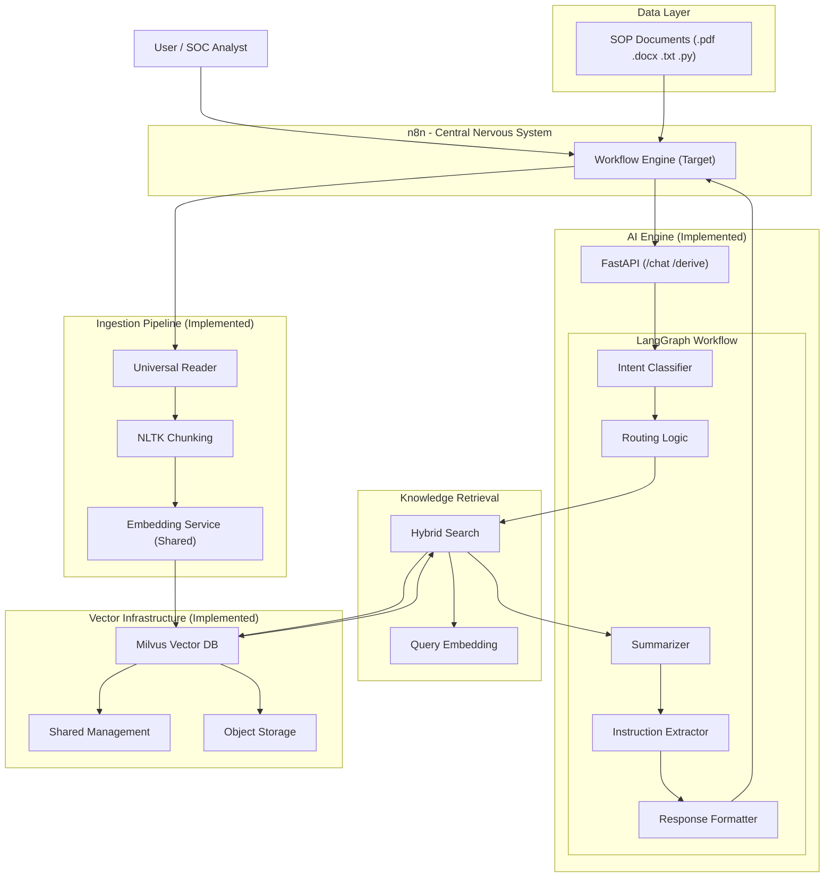

# Enterprise SOP Assistant Backend Architecture

This document defines the current and target architecture. It prioritizes the **Vector DB (Milvus)** as the single source for both knowledge and metadata, removing redundant databases like PostgreSQL for simplicity.

## System Architecture Diagram

## Component Overview: Current vs. Target

### 1. n8n Orchestration (Target Interface)
*   **Workflow Engine**: **[PLANNING]** This will act as the gatekeeper. It is not yet connected to the Python backend. Its role will be to connect to Google Drive/WhatsApp/Slack and route data to our FastAPI.

### 2. Ingestion Utility (`ingest_sops.py`)
*   **Status**: **[IMPLEMENTED]** 
*   **Logic**: Uses NLTK for semantic chunking and `pywin32` for Word doc extraction.
*   **Storage**: Pushes directly to Milvus. We don't need a separate SQL database because Milvus stores the **Page Content**, **FileName**, and **Source Path** directly in its collection metadata.

### 3. AI Engine (`sop_assistant_enterprise.py`)
*   **Status**: **[IMPLEMENTED]**
*   **FastAPI**: Active layer that handles requests for `/chat` and `/derive`.
*   **LangGraph**: Active workflow that manages the logic of *Identify Intent -> Retrieve Path -> Summarize -> Format*.

### 4. Vector Infrastructure (Docker)
*   **Milvus**: **[IMPLEMENTED]** This is our "Brain." It handles 100% of the long-term knowledge storage. 
*   **Why no SQL?**: By storing metadata (filename, category) alongside vectors in Milvus, we keep the architecture thin and avoid the "double-sync" problem where SQL and Vector DBs get out of sync.

### 5. Shared Memory Optimization
*   **Status**: **[IMPLEMENTED]**
*   **How**: All components share a single instance of `all-MiniLM-L6-v2`, reducing RAM usage by ~500MB.

## Production Roadmap: When do "Extras" become necessary?

While the current system is lean and functional, here is why you might eventually need the "extras" we discussed:

1.  **Redis (Session Caching)**: Currently, if the server restarts, the AI might "forget" the immediate context of a conversation. Redis makes the chat **persistent** and allows you to scale to hundreds of concurrent users.
2.  **PostgreSQL (Structured Analytics)**: Milvus is great for *searching* text, but Postgres is better for *reporting*. Use it if your manager wants a dashboard showing: "How many questions did we answer today?" or "Which SOPs are being used most?"
3.  **Monitoring (OpenTelemetry/Prometheus)**: Crucial for production to get an alert on your phone *before* the system crashes due to memory limits.

---
> [!IMPORTANT]
> **Minimalist Design**: We have deliberately excluded PostgreSQL and Redis. For a system processing SOPs, the Vector DB's ability to store metadata is sufficient for analytics and retrieval, keeping the footprint low.
