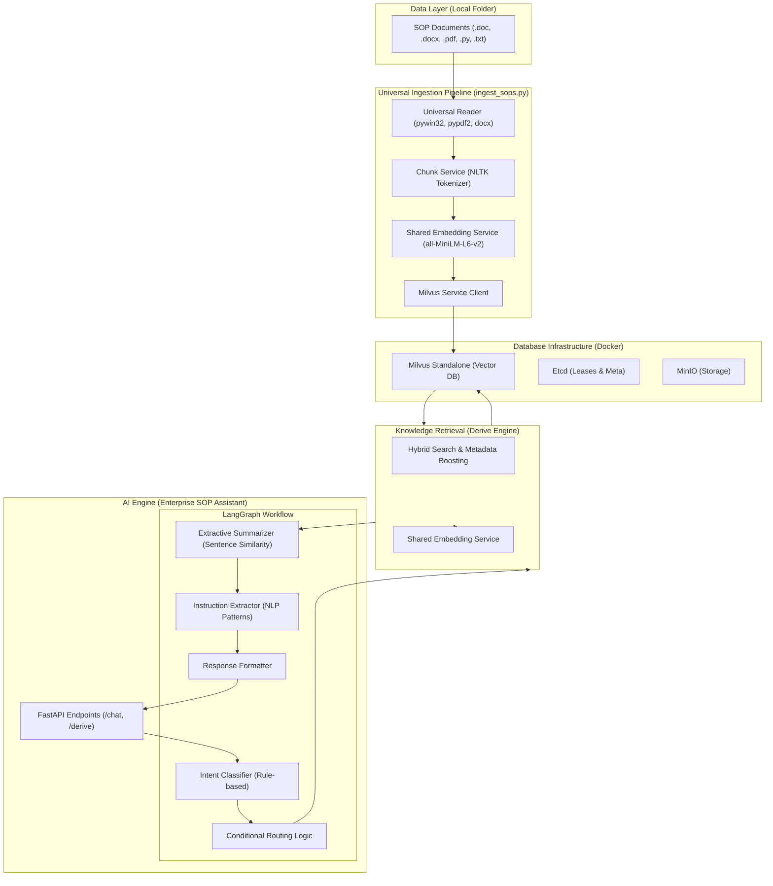

# Enterprise SOP Assistant Backend Architecture

This document outlines the internal architecture of the SOP Assistant backend, showing how data flows from ingestion to real-time chat.

## System Architecture Diagram

## Component Overview

### 1. Ingestion Utility (`ingest_sops.py`)
*   **Universal Reader**: Dynamically chooses extraction logic based on file extension.
*   **Chunking**: Uses NLTK to split text into 5-sentence "semantic bites" to balance detail and retrieval speed.
*   **Optimization**: Shares the same embedding model instance as the backend to save RAM.

### 2. AI Engine (`sop_assistant_enterprise.py`)
*   **LangGraph**: Manages the state and conversation flow. It ensures the system follows a logical path: *Identify Intent -> Retrieve Path -> Summarize -> Format*.
*   **Hybrid Summarizer**: Does not "hallucinate" because it is purely extractive. It ranks existing sentences by similarity to your question using the transformer model.
*   **Intent Classifier**: A lightweight pattern-matcher that detects if you want a summary, a step-by-step guide, or just a greeting.

### 3. Retrieval Engine (`derive_engine.py`)
*   **Hybrid Logic**: Combines vector similarity (mathematical relevance) with metadata boosting (prioritizing specific threat types or categories).

### 4. Infrastructure (Docker)
*   **Milvus**: Handles thousands of high-speed vector searches.
*   **Optimization**: Merged to a single-node configuration with strict memory limits (Total ~2GB) to ensure stability on systems with 8GB RAM.

---
> [!NOTE]
> The **Shared Embedding Service** is a critical optimization. By loading the model once in the parent process, all child components access the same memory, preventing RAM thrashing.
