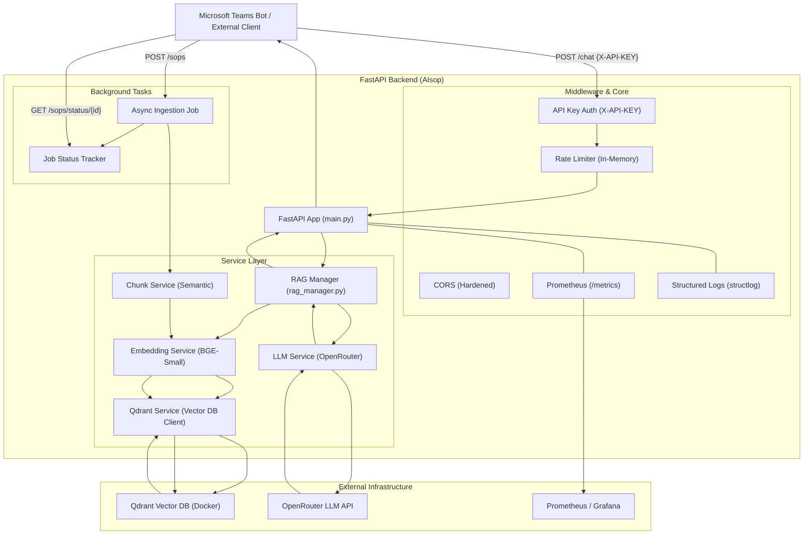

# Enterprise SOP Assistant Backend Architecture

This document defines the current backend architecture. It prioritizes a **FastAPI** backend with a **Single-Container Vector DB (Qdrant)** for simplicity, speed, and production readiness.

## System Architecture Diagram

```mermaid
graph TD

%% ================= CLIENT LAYER =================
Client["Microsoft Teams Bot / External Client"]

%% ================= BACKEND LAYER =================
subgraph Backend ["FastAPI Backend (AIsop)"]
    API["FastAPI App (main.py)"]

    subgraph Middleware ["Middleware & Core"]
        Auth["API Key Auth (X-API-KEY)"]
        RateLimit["Rate Limiter (In-Memory)"]
        CORS["CORS (Hardened)"]
        Metrics["Prometheus (/metrics)"]
        Logs["Structured Logs (structlog)"]
    end

    subgraph Services ["Service Layer"]
        RAG["RAG Manager (rag_manager.py)"]
        LLM["LLM Service (OpenRouter)"]
        Qdrant["Qdrant Service (Vector DB Client)"]
        Embed["Embedding Service (BGE-Small)"]
        Chunk["Chunk Service (Semantic)"]
    end

    subgraph Workers ["Background Tasks"]
        IngestJob["Async Ingestion Job"]
        StatusTracker["Job Status Tracker"]
    end
end

%% ================= INFRASTRUCTURE =================
subgraph Infra ["External Infrastructure"]
    QDB["Qdrant Vector DB (Docker)"]
    OpenRouter["OpenRouter LLM API"]
    Prom["Prometheus / Grafana"]
end

%% ================= QUERY FLOW =================
Client -->|"POST /chat {X-API-KEY}"| Auth
Auth --> RateLimit
RateLimit --> API
API --> RAG
RAG --> Embed
Embed --> Qdrant
Qdrant --> QDB
QDB --> Qdrant
RAG --> LLM
LLM --> OpenRouter
OpenRouter --> LLM
LLM --> RAG
RAG --> API
API --> Client

%% ================= INGESTION FLOW =================
Client -->|"POST /sops"| IngestJob
IngestJob --> Chunk
Chunk --> Embed
Embed --> Qdrant
Qdrant --> QDB
IngestJob --> StatusTracker
Client -->|"GET /sops/status/{id}"| StatusTracker

%% ================= OBSERVABILITY =================
API --- Metrics
API --- Logs
Metrics --> Prom
```

## Component Overview

### 1. API Security & Control
*   **API Key Authentication**: Required for all protected endpoints (`/chat`, `/search`, `/sops`). Validates the `X-API-KEY` header using `secrets.compare_digest`.
*   **Rate Limiting**: Protects against DOS by limiting requests per window (IP-based).
*   **CORS Hardening**: Strictly allows origins defined in `.env`.

### 2. Service Layer
*   **RAG Manager**: Orchestrates the interaction between the query, vector search, and LLM to provide context-aware answers.
*   **LLM Service**: Connects to **OpenRouter** (e.g., StepFun Step-3.5-Flash) for response generation.
*   **Qdrant Service**: Handles all vector operations (Insert, Search, Health).
*   **Embedding Service**: Uses local `bge-small-en-v1.5` for high-performance vector creation.
*   **Chunk Service**: Implements semantic chunking logic.

### 3. Ingestion Pipeline
*   **Asynchronous Ingestion**: Ingesting large SOPs happens in the background to prevent request timeouts.
*   **Job Status Tracking**: Clients can query the status of their ingestion tasks via `/sops/status/{job_id}`.

### 4. Observability & Monitoring
*   **Prometheus Metrics**: Exposes `/metrics` with counters for requests, latency, active connections, and ingestion status.
*   **Structured Logging**: Uses `structlog` for JSON-formatted logs, making it easy to parse in ELK/Loki stacks.
*   **Health Checks**: `/health` checks connectivity for both Qdrant and the LLM service.

### 5. Vector Infrastructure
*   **Qdrant**: A high-performance vector database running in a Docker container. It handles vector storage, similarity search, and payload filtering.

---
> [!NOTE]
> **Production Ready**: The backend is built to be stateless (except for memory job tracking) and is ready for horizontal scaling behind a load balancer.
